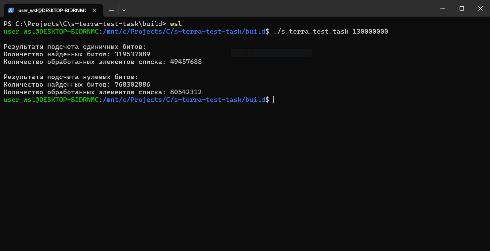

# Тестовое задание С-Терра

## Задание

Сформировать в памяти один двусвязный список, содержащий случайные значения, которые следует получить из генератора случайных чисел.

Программа должна принимать на вход количество элементов в двухсвязном списке.

Запустить два потока.

Потоку №1: начиная с головы списка подсчитывать количество нулевых битов в значениях элементов и количество пройденных элементов, освобождать учтённый элемент сразу после учёта.

Потоку №2: начиная с хвоста списка подсчитывать количество единичных битов в значениях элементов и количество пройденных элементов, освобождать учтённый элемент сразу после учёта.

По окончании элементов списка вывести результаты подсчёта.

Обеспечить однократную обработку каждого элемента списка (каждый должен быть учтён, но только один раз, одним из потоков).

Очень желательно, чтобы в потоках работали не две разные функции, а одна, принимающая особенности работы через аргументы.

## Стек

| Наименование | Значение |
|:---|:---|
| Операционная система | Debian GNU/Linux 12 (bookworm) x86_64 & Ubuntu 22.04.4 LTS on Windows 10 x86_64 |
| Версия CMake | 3.25.1 |
| Стандарт языка C | C99 |

## Результат выполнения

